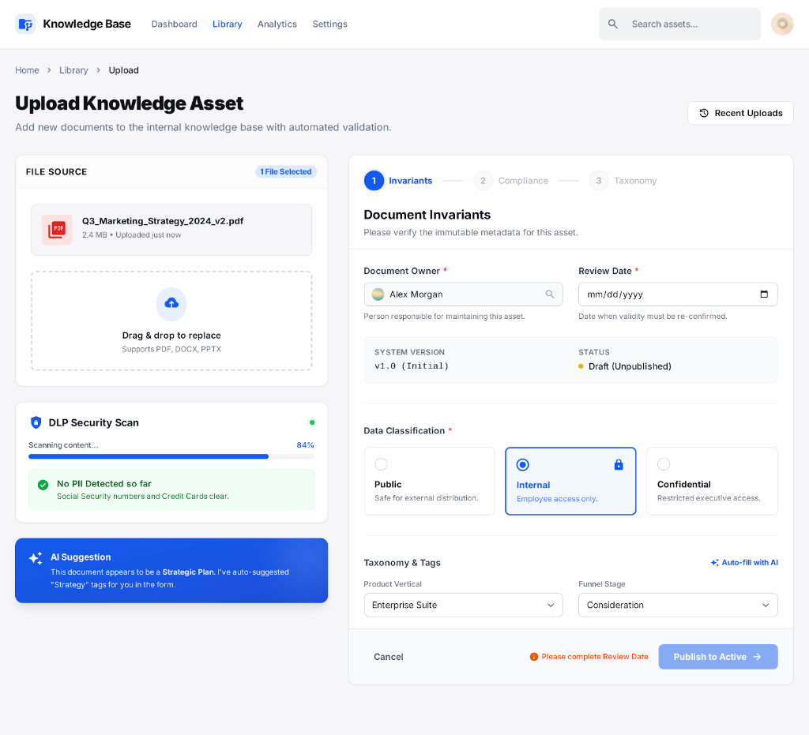
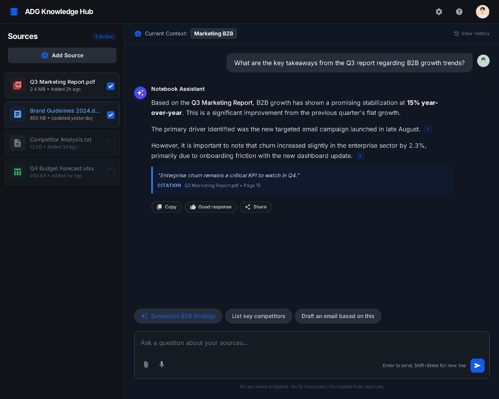
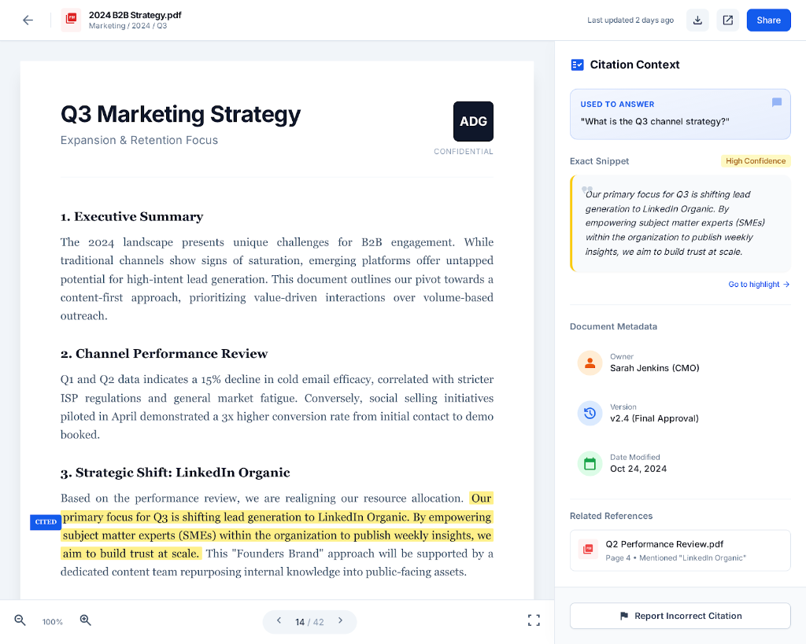
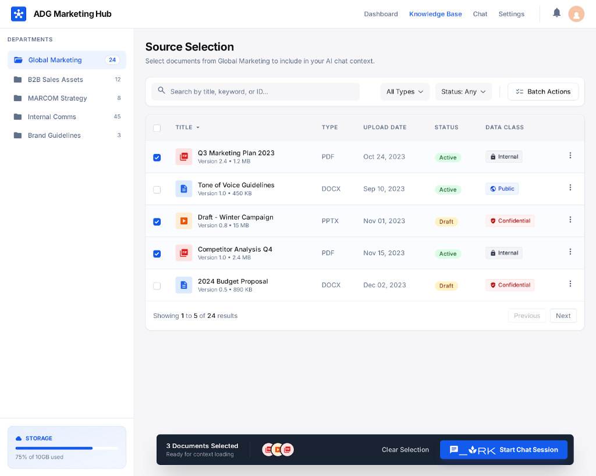

# UI Reference - Giao Diện Tham Khảo

> **Mục đích**: Tài liệu này tổng hợp các mockup giao diện tham khảo cho ADG Knowledge Management System.

---

## 1. Upload Wizard (Trang Upload Tài Liệu)

**Các thành phần chính:**
- File upload với drag & drop
- DLP Security Scan (quét PII tự động)
- AI Suggestion (gợi ý tags)
- Document Invariants: Owner, Review Date, Version, Status
- Data Classification: Public / Internal / Confidential
- Taxonomy & Tags

---

## 2. Dashboard Overview (Trang Tổng Quan)

**Các thành phần chính:**
- Stats cards: Total Assets, Active Documents, Metadata Alerts, AI Queries
- Department sidebar: D2Com, B2B, S2B2C, MARCOM
- Critical Alerts panel
- Recent Golden Answers với AI Generated tag

---

## 3. Chat Interface (Giao Diện Chat)

**Các thành phần chính:**
- Sources sidebar với checkbox
- Current Context indicator
- Notebook Assistant với citations
- Quick action buttons: Summarize, List key competitors, Draft email
- Input với attach và voice

---

## 4. Document Viewer (Xem Tài Liệu + Citation)

**Các thành phần chính:**
- PDF viewer với highlight
- Citation Context panel
- Document Metadata: Owner, Version, Date Modified
- Related References
- Report Incorrect Citation button

---

## 5. Source Selection (Chọn Nguồn)

**Các thành phần chính:**
- Department tree sidebar
- Document table với: Title, Type, Upload Date, Status, Data Class
- Filters: All Types, Status: Any
- Batch Actions
- Storage indicator
- Start Chat Session button
